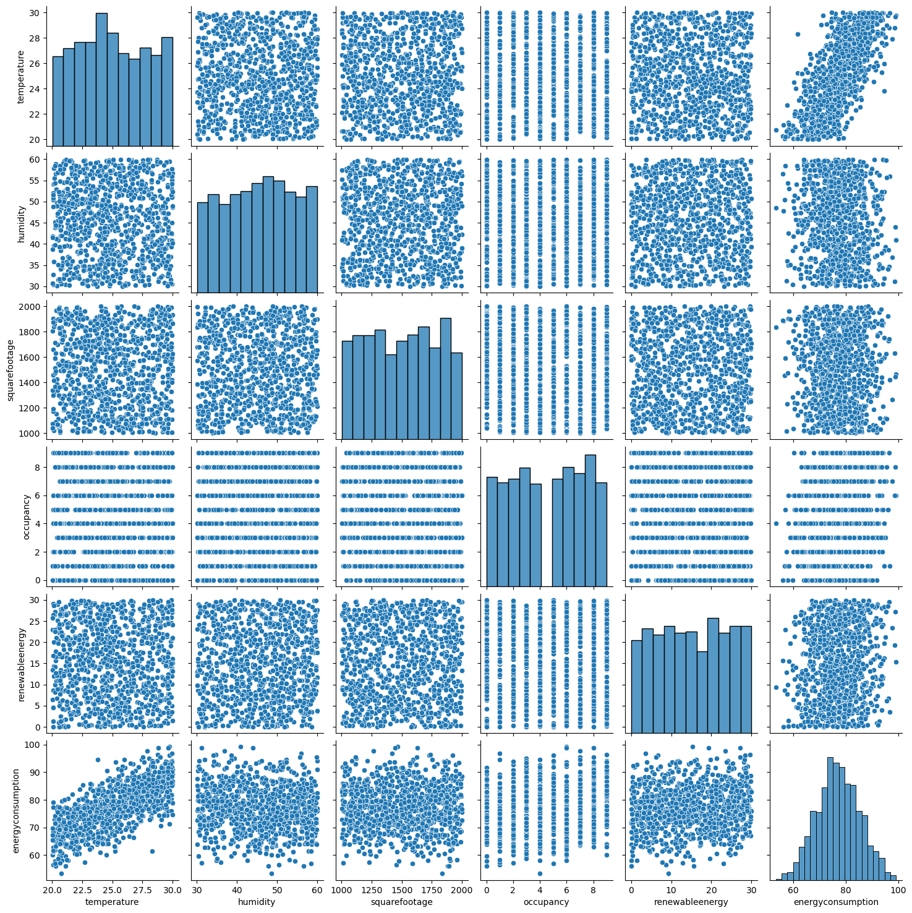
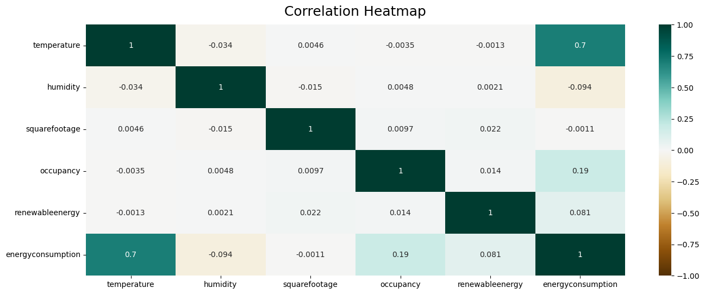
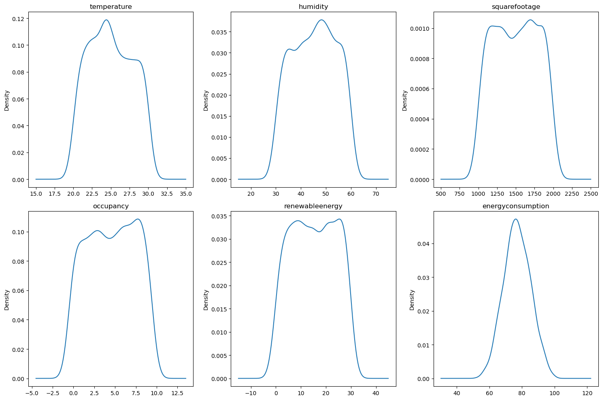
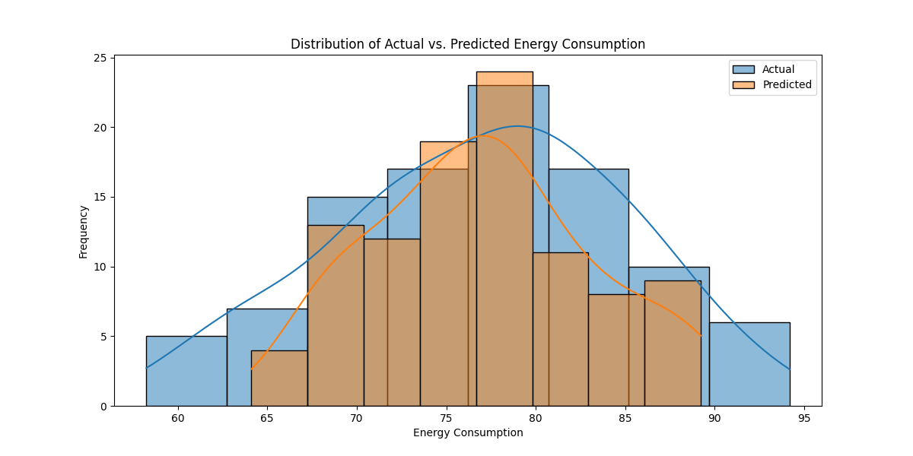
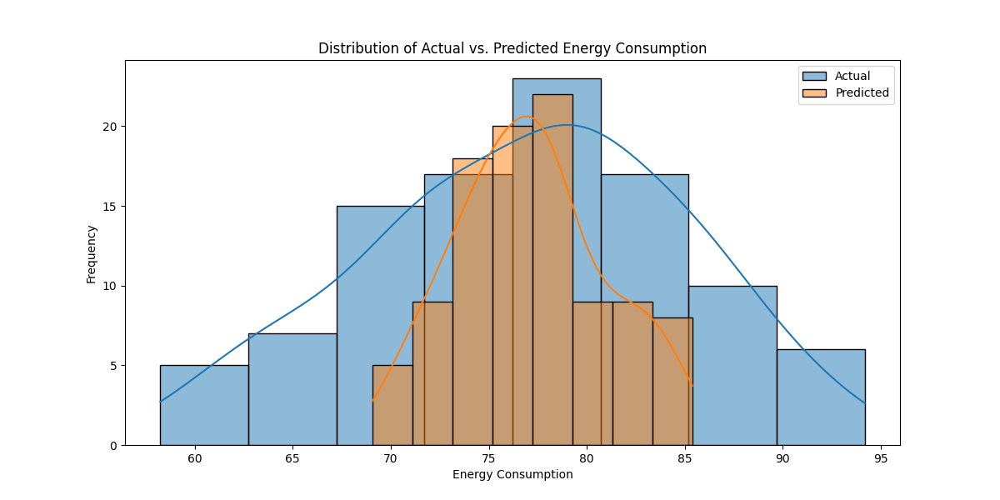
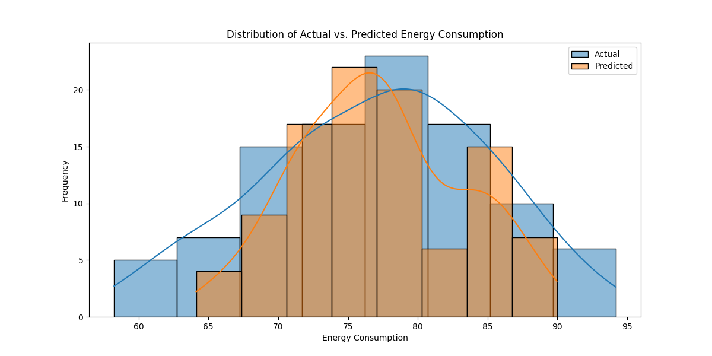
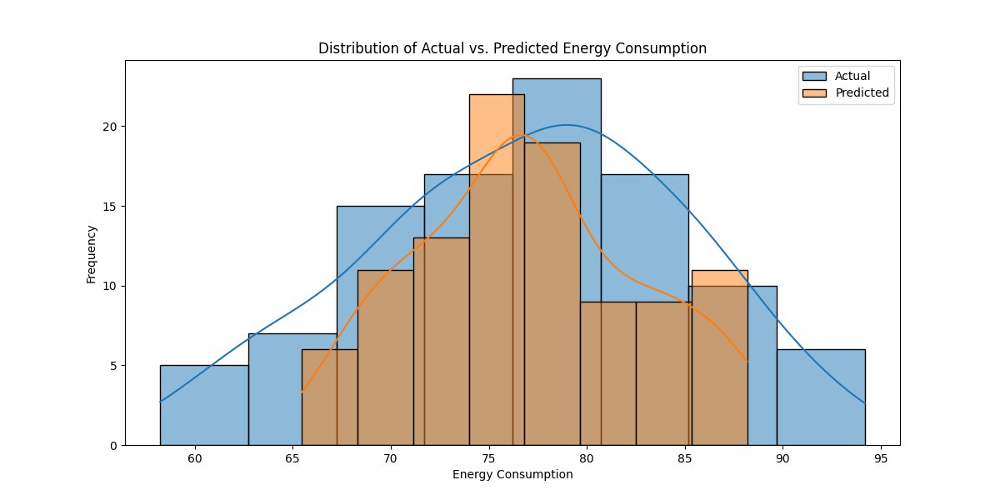

# Table of Contents

1. [Dataset Description](#dataset-description-and-cleaning)
2. [EDA (Exploratory Data Analysis)](#eda-exploratory-data-analysis)
3. [Model Training](#model-training)
   - [Model Overview](#model-overview)
   - [Evaluation Metric](#evaluation-metric)
   - [Hyperparameter Tuning](#hyperparameter-tuning)
4. [Deployment: Flask-Based Web Service](#deployment-flask-based-web-service)

## Dataset Description and Cleaning

Dataset URL: [Kaggle - Energy Consumption Prediction](https://www.kaggle.com/datasets/mrsimple07/energy-consumption-prediction/data)

This dataset captures a wide range of features that influence energy consumption. It includes temporal, environmental, and operational attributes relevant to building energy usage.

**Key Features:**
| Feature         |	Description                                                                          |
|-----------------|--------------------------------------------------------------------------------------|
|Timestamp        |	Timestamp for each recorded data point.                                       |
|Temperature      |	Simulated ambient temperature (°C).                                                  |
|Humidity         |	Simulated relative humidity (%).                                                     |
|SquareFootage    |	Size of the building/environment (square feet).                                               |
|Occupancy        |	Number of people present (integer).                                               |
|HVACUsage        |	HVAC system operational status ('On' or 'Off').                                     |
|LightingUsage    |	Lighting system operational status ('On' or 'Off').                                 |
|RenewableEnergy  |	Percentage of energy coming from renewable sources.                                       |
|DayOfWeek        |	Day of the week (categorical).                                                       |
|Holiday          |	Indicates whether the day is a holiday ('Yes' or 'No').                                   |
|EnergyConsumption|	Actual energy consumption value (target variable).                                         |


All data cleaning and preprocessing steps are implemented in the file processing_and_EDA.py

The dataset was first loaded using pandas, and all column names were standardized by converting them to lowercase and replacing spaces with underscores to ensure consistency and ease of reference. The timestamp column was then processed to extract temporal components such as month, day, and hour, allowing for more flexible time-based analysis. Columns like year, minute, and second were removed after confirming they contained no useful variation (e.g., the year was always 2022, and the minute/second fields were constant). Categorical string values throughout the dataset were cleaned by converting them to lowercase.
The dataset’s features were then organized by data type: numerical columns (including occupancy, which was treated as a continuous variable despite being an integer) and categorical columns. Duplicate rows were removed to avoid data leakage or bias in model training, and a check for missing values was performed, none were found, so no imputation was necessary.

## EDA (Exploratory Data Analysis)



To visually explore the relationships between numerical features, a pairplot was generated. This plot allows us to simultaneously inspect the distribution of individual variables and their pairwise scatter plots. One of the most prominent observations is the strong positive linear relationship between temperature and energy consumption, this likely reflects greater cooling demands during hotter periods. 

In contrast, most other features, such as humidity, square footage, renewable energy, and occupancy, show no clear linear pattern with energy consumption in the scatter plots. This suggests that their individual contribution to the target variable may be limited or more complex (e.g., nonlinear or interaction-based).




To quantify linear relationships between variables, a correlation heatmap was created. This visualization highlights the strength and direction of pairwise correlations among numerical features, particularly in relation to the target variable, energy consumption. The most significant insight is the strong positive correlation between temperature and energy consumption (correlation coefficient ≈ 0.70), reinforcing the observation from the pairplot. This confirms that temperature is a key driver of energy usage.
The variable occupancy also shows a modest positive correlation with energy consumption (≈ 0.19), indicating that more occupants tend to be associated with higher energy use, though the relationship is not as strong.

Other variables like humidity, square footage, and renewable energy display very weak or negligible correlations (coefficients close to zero), suggesting that they either have minimal influence on energy consumption or that their relationships are not linear in nature.



To understand the shape and spread of each numerical variable, kernel density estimation (KDE) plots were generated. These plots provide a smoothed approximation of the data distributions, helping to identify skewness, multimodality, and outliers.
Several features exhibit bimodal or multimodal tendencies—for instance, temperature, occupancy, and square footage all show distributions with multiple peaks. This suggests the presence of distinct operational regimes or usage patterns within the dataset. For example, occupancy likely reflects different scheduled uses (e.g., working hours vs. off-hours), while square footage may vary due to different building zones or types.
Energy consumption, the target variable, follows a roughly normal distribution, with a slight left skew. This is a desirable property for many regression algorithms, as normally distributed targets often lead to better model performance and more stable residuals.
Interestingly, renewable energy also displays a somewhat uniform and spread-out distribution, which might indicate variability in usage or generation over time. Humidity, on the other hand, shows a more classic unimodal shape centered around moderate values.


| Feature         |	Distribution Type | Test Statistic | p-value |                                                   
|-----------------|-------------------|----------------|-------------------------------------------------|
|Temperature        |	Not Gaussian      |   409.51 | 1.19e-89                           |
|Humidity      |	Not Gaussian   |459.57 |	1.61e-100                                              |
|SquareFootage         |	Not Gaussian 	| 947.45	| 1.84e-206                                       |
|Occupancy    |	Not Gaussian  | 982.95	| 3.58e-214                                             |
|RenewableEnergy  |	Not Gaussian | 871.02	| 7.24e-190
|EnergyConsumption|	Gaussian | 	5.10	| 0.078                                     |

To statistically assess whether the numerical features follow a Gaussian distribution, the D’Agostino-Pearson’s normality test was applied to each variable. This test evaluates skewness and kurtosis to determine if a distribution significantly deviates from normality. The results confirm what the KDE plots visually suggested:

- All features except energy consumption were found to be non-Gaussian, with extremely low p-values (≪ 0.05), indicating strong evidence against the null hypothesis of normality.
- In contrast, energy consumption was the only feature that did not reject normality at the 5% significance level, with a p-value of approximately 0.078. This aligns with its relatively symmetric and bell-shaped distribution seen earlier.

## Model Training

To predict energy consumption based on the features in our dataset, we evaluated four different machine learning models: Linear Regression, Support Vector Regressor (SVR), Random Forest Regressor, and Gradient Boosting Regressor.
These models were chosen for their diversity in learning strategies ranging from simple linear modeling to powerful ensemble methods capable of capturing complex patterns.

### Model Overview

- Linear Regression:
  A baseline model that assumes a linear relationship between the features and the target. It is fast and interpretable but         performs poorly when the underlying data relationships are non-linear or complex.

- Support Vector Regressor (SVR):
  Effective for capturing non-linear relationships, especially with the RBF kernel. However, SVR is sensitive to feature scaling    and computationally expensive on larger datasets.

- Random Forest Regressor:
  An ensemble of decision trees that reduces overfitting by averaging multiple models. It handles non-linearities well and is       robust to outliers. However, it can be less interpretable and may require tuning for optimal performance.

- Gradient Boosting Regressor:
  A sequential ensemble technique that improves performance by correcting the errors of previous models. It often achieves high     accuracy but is more sensitive to hyperparameters and slower to train compared to Random Forests.

### Evaluation Metric

All models were evaluated using Root Mean Squared Error (RMSE), which is suitable for regression tasks where larger errors should be penalized more heavily. RMSE is defined as:

$RMSE = \sqrt(\frac{1}{n} \Sigma_{i =1}^n (y_i - \hat{y}_i)^2$,

it provides an interpretable measure of prediction error in the same units as the target variable (in this case, energy consumption).

### Hyperparameter Tuning

We applied hyperparameter tuning using GridSearchCV to the Random Forest and Gradient Boosting models. These ensemble methods benefit the most from tuning due to the number of hyperparameters involved (e.g., tree depth, number of estimators, learning rate). Grid search was performed over a predefined range of values with 5-fold cross-validation, optimizing for RMSE via a custom scoring function.
Tuning these models helped improve generalization and slightly reduced the prediction error on the test set, as reflected in the final RMSE values.

Final Results 
| Model         |	Tunned | RSME |                                                
|-----------------|-------------------|----------------|
|Linear Regression        |	---     |  4.9022 | 
|SVR      |	---   |5.8342	 |	
|Random Forest Regressor         |	No 	|  5.2306| 
|Random Forest Regressor         |	Yes 	|  5.1147| 
|Gradient Boosting Regressor  |	No | 5.4768	|
|Gradient Boosting Regressor  |	Yes |  5.0340	|

Among all models, Linear Regression achieved the lowest RMSE despite its simplicity, suggesting that the relationships in the dataset may be largely linear or that the categorical encoding favored this model.
Nevertheless, Gradient Boosting (after tuning) came very close in performance, and given its flexibility, it may be preferred in real-world applications where generalization across unseen scenarios is critical.
To better understand each model’s performance beyond the RMSE metric, we visualized the distribution of predicted versus actual energy consumption. The following figures show how closely each model’s predictions align with the actual data distribution:

Linear Regression;



SVR;



Random Forest Regressor;



Gradient Boosting Regressor;



From these visualizations, we observe that ensemble methods like Random Forest and Gradient Boosting produce distributions that more closely follow the actual values, while simpler models like Linear Regression tend to underfit the variance in the data.

## Deployment: Flask-Based Web Service

To make the trained machine learning models accessible for inference, they were deployed using a Flask web application. Flask is a lightweight Python web framework that allows for quickly creating APIs to serve models. The deployment logic is implemented in a file named deployed_flask.py. This application loads the trained models and the DictVectorizer object used during preprocessing. It exposes a single endpoint /forecast_demand which accepts POST requests with energy consumption-related features in JSON format and returns the predicted values from all four models.

Example Usage:

Once the application is running (by executing python deployed_flask.py), users can interact with the API using tools such as curl. Below is an example request:

```
curl -X POST http://localhost:9696/forecast_demand
 -H "Content-Type: application/json"
 -d "{\"temperature\":25.1394334377269,
      \"humidity\":43.43158120480281,
      \"squarefootage\":1565.6939992511177,
      \"occupancy\":5,
      \"hvacusage\":\"on\",
      \"lightingusage\":\"off\",
      \"dayofweek\":\"monday\",
      \"holiday\":\"no\",
      \"month\":1,
      \"day\":1,
      \"hour\":0}"

curl -X POST http://localhost:9696/forecast_demand -H "Content-Type: application/json" -d "{\"temperature\":25.1394334377269,\"humidity\":43.43158120480281,\"squarefootage\":1565.6939992511177,\"occupancy\":5,\"hvacusage\":\"on\",\"lightingusage\":\"off\",\"dayofweek\":\"monday\",\"holiday\":\"no\",\"month\":1,\"day\":1,\"hour\":0}"
```

The server responds with a JSON object containing the predicted energy consumption from each of the models:

```
{
  "prediction_linear_regression": 78.23,
  "prediction_svr": 76.54,
  "prediction_random_forest_regressor": 79.88,
  "prediction_gradient_boosting_regressor": 77.65
}
```

This setup makes the prediction pipeline accessible for integration with external applications, dashboards, or automation scripts.


